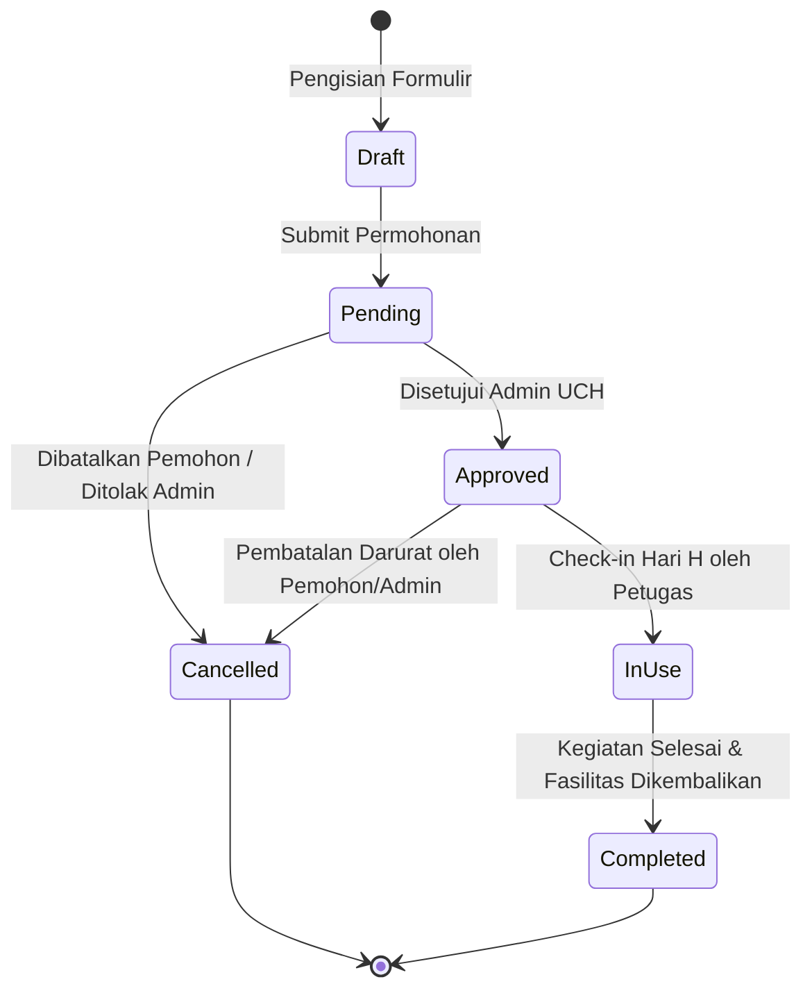

# Product Requirement Document (PRD): Feature Booking Fasilitas UTY Creative Hub (UCH)

**Versi**: 1.0  
**Status**: Disahkan (Approved)  
**Target Rilis**: UCH Web App v0.2.0  
**Penanggung Jawab**: Product & Engineering Team UCH  
**Lokasi Proyek**: `uchwebapp`  

---

## 1. Latar Belakang & Pernyataan Masalah

### 1.1 Masalah Saat Ini (Problem Statement)
Sebelum adanya sistem web mandiri, peminjaman ruangan dan fasilitas di UTY Creative Hub (seperti *Co-Working Space*, *FastLab IoT*, dan *Think Tank Meeting Room*) dilakukan secara manual via formulir fisik atau chat WhatsApp ke sekretariat kampus. Hal ini menimbulkan sejumlah kendala:
1. **Tabrakan Jadwal (*Booking Collision*)**: Mahasiswa dan dosen tidak dapat melihat ketersediaan ruangan secara real-time, menyebabkan dua tim sering mengajukan waktu yang sama.
2. **Proses Verifikasi Lambat**: Verifikasi status kepengurusan mahasiswa atau data dosen memerlukan pengecekan manual yang memakan waktu berhari-hari.
3. **Hilangnya Bukti Peminjaman Fisik**: Surat izin sering tertinggal saat kegiatan berlangsung di lokasi.
4. **Tidak Ada Riwayat Terpusat**: Mahasiswa tidak memiliki catatan peminjaman terdahulu, dan pengelola kesulitan mengukur utilisasi fasilitas kampus.

### 1.2 Tujuan Produk (Objective)
Membangun platform reservasi daring terpadu yang memfasilitasi mahasiswa dan dosen UTY untuk:
- Mengecek ketersediaan fasilitas secara transparan dan seketika (*real-time*).
- Mengajukan peminjaman dalam hitungan detik dengan integrasi profil SSO kampus.
- Memantau proses persetujuan transparan hingga penerbitan **E-Tiket resmi**.

---

## 2. Target Pengguna (User Persona)

| Persona | Profil & Karakteristik | Kebutuhan Utama | Hambatan Utama |
| :--- | :--- | :--- | :--- |
| **Mahasiswa Aktif** (Ketua UKM, Tim Riset, Peserta PKM) | Mengorganisasi workshop, rapat divisi, shooting podcast, atau perakitan alat IoT. | - Proses reservasi cepat dari HP. - Auto-fill data SSO (NPM & Prodi). - Bukti reservasi digital (E-Tiket). | Sering terburu-buru, butuh kepastian persetujuan jadwal secara cepat. |
| **Dosen / Tenaga Pengajar** | Mengadakan bimbingan penelitian, evaluasi proyek, atau pelatihan teknologi bersama mitra industri. | - Opsi kategori pemohon khusus Dosen (NIDN). - Prioritas peminjaman untuk riset hibah/PKM. | Tidak ingin direpotkan dengan formulir administratif yang rumit. |
| **Pengelola Fasilitas / Admin UCH** | Staf pengelola gedung dan laboran FastLab yang bertugas meninjau kelayakan acara dan alokasi perangkat. | - Dashboard antrean permohonan. - Log bentrok jadwal otomatis. - Tombol persetujuan / penolakan dengan catatan. | Kesulitan melacak log inventaris jika terjadi kerusakan fasilitas. |

---

## 3. End-to-End User Flow (Alur Pengguna Lengkap)

Berikut adalah diagram alur menyeluruh mulai dari pencarian fasilitas hingga kegiatan selesai:

```mermaid
flowchart TD
    Start([Pengguna Masuk ke Web UCH]) --> NavSchedule[Buka Halaman /booking]
    NavSchedule --> CheckRoom[Pilih Ruangan & Cek Kalender Ketersediaan]
    
    CheckRoom --> HasSlot{Slot Waktu Tersedia?}
    HasSlot -- Tidak --> SelectOtherDate[Pilih Hari / Sesi Lain]
    SelectOtherDate --> CheckRoom
    
    HasSlot -- Ya --> ClickBook[Klik 'Book Now' / 'Ajukan Peminjaman']
    ClickBook --> FormPage[Masuk ke Halaman /booking/new]
    
    FormPage --> RoleSelection[Pilih Kategori: Mahasiswa atau Dosen]
    RoleSelection --> AutoFillCheck{Gunakan Data SSO Login?}
    
    AutoFillCheck -- Ya --> PopulateSSO[Otomatis Mengisi Nama, NPM/NIDN, Prodi, Email]
    AutoFillCheck -- Tidak --> ManualInput[Input Manual Data Identitas & Kontak WA]
    
    PopulateSSO --> FillEvent[Isi Tanggal, Jam, Estimasi Peserta & Tujuan Kegiatan]
    ManualInput --> FillEvent
    
    FillEvent --> Validation{Validasi Form Lolos?}
    Validation -- Gagal --> ShowError[Tampilkan Pesan Error di Form]
    ShowError --> FillEvent
    
    Validation -- Sukses --> SubmitBooking[Kirim Permohonan]
    SubmitBooking --> TicketConfirmation[Tampil Tiket Konfirmasi Pengajuan]
    TicketConfirmation --> NotificationSent[Notifikasi Sistem Terkirim ke Admin & Akun]
    
    NotificationSent --> AdminReview{Admin UCH Review Pengajuan}
    AdminReview -- Ditolak / Revisi --> RejectStatus[Status: Dibatalkan / Catatan Revisi]
    RejectStatus --> PushNotifReject[Notifikasi Alasan Penolakan ke Pengguna]
    
    AdminReview -- Disetujui --> ApproveStatus[Status: Disetujui & Terjadwal]
    ApproveStatus --> IssueTicket[E-Tiket Digital Terbit di /my-bookings]
    IssueTicket --> PushNotifApprove[Notifikasi Persetujuan ke Akun Pengguna]
    
    PushNotifApprove --> DayOfEvent[Hari H Kegiatan di Gedung UCH]
    DayOfEvent --> CheckIn[Tunjukkan E-Tiket ke Petugas di Lokasi]
    CheckIn --> StatusInUse[Kegiatan Berlangsung / Status: In-Use]
    StatusInUse --> EventFinished[Kegiatan Berakhir]
    EventFinished --> CheckOut[Inspeksi Kebersihan & Serah Terima Kunci]
    CheckOut --> StatusCompleted[Status: Selesai Digunakan]
    StatusCompleted --> ArchiveHistory[Tersimpan di Riwayat Peminjaman]
```

### 3.1 Penjelasan Tahapan Alur

#### Tahap 1: Pra-Booking & Discovery (Eksplorasi)
1. Pengguna membuka `/booking` untuk melihat katalog 3 ruangan utama:
   - *Co-Working Space & Ideation Hall* (Kapasitas 40 orang).
   - *FastLab Prototyping & IoT Lab* (Kapasitas 20 orang).
   - *Think Tank Meeting Room* (Kapasitas 12 orang).
2. Pengguna memanfaatkan **Schedule Navigator** untuk melihat status slot waktu per hari (Tersedia, Sedang Digunakan, Dipesan).

#### Tahap 2: Pengisian Formulir (`/booking/new`)
1. Pengguna diarahkan ke halaman mandiri formulir peminjaman berukuran penuh (*full-width container*).
2. Terdapat **Profile Switcher**:
   - Pilihan kategori: **Mahasiswa** (NPM) atau **Dosen** (NIDN).
   - Switch toggle: *"Gunakan profil login saya"* (otomatis mengisi data SSO tanpa perlu mengetik ulang).
3. Pengisian data kegiatan:
   - Pilihan ruangan, tanggal kegiatan (interaktif via Calendar Picker).
   - Jam mulai & jam selesai (dropdown interval 30 menit).
   - Estimasi jumlah peserta dan deskripsi tujuan kegiatan.
4. Sistem mengecek *client-side validation* seketika (Zod schema).

#### Tahap 3: Verifikasi & Peninjauan Admin
1. Pengajuan masuk ke antrean dengan status **`pending` (Menunggu Review)**.
2. Pengguna mendapatkan ID Referensi Peminjaman unik (misal: `UCH-849201`).
3. Sistem mengirimkan notifikasi internal ke pengelola fasilitas.

#### Tahap 4: Penerbitan E-Tiket & Pengingat
1. Setelah disetujui, status berubah menjadi **`approved` (Disetujui)**.
2. E-Tiket diterbitkan dan dapat diunduh/dilihat di halaman `/my-bookings`.
3. Notifikasi dikirimkan ke Pusat Notifikasi (`/notifications`) dan simulasi WhatsApp H-1.

#### Tahap 5: Pelaksanaan & Check-In Lokasi
1. Pada hari H, penanggung jawab menunjukkan E-Tiket (QR Code / Kode Booking) kepada laboran/resepsionis UCH.
2. Ruangan dibuka dan perangkat inventaris diserahkan.

#### Tahap 6: Pasca-Kegiatan & Riwayat
1. Setelah kegiatan usai, dilakukan inspeksi kebersihan dan peralatan.
2. Status diperbarui menjadi **`completed` (Selesai)**.
3. Riwayat tercatat secara permanen di profil pengguna dengan metrik statistik jam peminjaman.

---

## 4. Siklus Hidup Status Reservasi (State Machine)

Status peminjaman dikelola menggunakan state machine terdefinisi ketat:

### Matriks Definisi Status:

| Status | Label UI | Warna Badge | Aksi yang Tersedia Bagi Pengguna |
| :--- | :--- | :--- | :--- |
| `pending` | Menunggu Verifikasi | Amber / Kuning | Batalkan Permohonan, Lihat Detail |
| `approved` | Disetujui & Terjadwal | Emerald / Hijau | **Unduh / Buka E-Tiket Digital**, Batalkan (H-1) |
| `in-use` | Sedang Digunakan | Biru / Indigo | Lihat Kontak Petugas Piket |
| `completed` | Selesai Digunakan | Slate / Netral | Unduh Bukti Selesai, Booking Ulang |
| `cancelled` | Dibatalkan | Rose / Merah | Lihat Alasan Pembatalan |

---

## 5. Aturan Bisnis & Logika Validasi (Business Logic Rules)

### 5.1 Aturan Identitas & Autentikasi
- **Mahasiswa**:
  - Wajib memiliki NPM valid (hanya angka numerik, panjang 10 digit, contoh: `5210411234`).
  - Wajib memilih Program Studi resmi di lingkungan UTY.
- **Dosen / Tenaga Pendidik**:
  - Wajib menyertakan Nama Lengkap beserta Gelar Akademik.
  - Wajib menyertakan NIDN (Nomor Induk Dosen Nasional) atau NIK dinas.

### 5.2 Aturan Jadwal & Batasan Waktu
- **Jam Operasional Fasilitas**: Pukul **08:00 WIB s/d 18:00 WIB** (Senin - Sabtu).
- **Durasi Peminjaman**: Minimal 1 jam, maksimal 4 jam per sesi per hari (untuk memberi kesempatan merata bagi civitas academica lain).
- **Batas Waktu Pengajuan**: Pengajuan minimal **H-1** (24 jam sebelum kegiatan) dan maksimal **H+14** hari ke depan.
- **Validasi Waktu**: Jam Selesai harus lebih besar dari Jam Mulai (`endTime > startTime`).
- **Collision Detection**: Sistem mencegah pengajuan waktu yang tumpang tindih dengan jadwal yang sudah berstatus `approved` atau `in-use`.

### 5.3 Aturan Kapasitas & Perlengkapan
- Jumlah peserta tidak boleh melebihi batas maksimum ruangan:
  - *Co-Working Space*: Maksimal 40 orang.
  - *FastLab IoT*: Maksimal 20 orang.
  - *Think Tank*: Maksimal 12 orang.
- Jika peserta melebihi kapasitas, sistem akan menampilkan peringatan (*warning recommendation*).

---

## 6. Desain UX & Interaksi Antarmuka

1. **Responsivitas Layar Penuh (*Full Container*)**:
   - Form tidak lagi berada dalam modal sempit, melainkan di halaman penuh `/booking/new` yang proporsional di HP (375px) hingga layar Ultra-Wide desktop.
2. **Seamless SSO Switcher**:
   - Pengguna tidak dipaksa mengetik data yang sama berulang kali. Satu klik tombol switch langsung mengisi identitas dari sesi SSO.
3. **E-Tiket Digital Interaktif Modal**:
   - Modal E-Tiket modern yang dilengkapi logo resmi, barcode/QR Code visual, rincian ruangan, sesi waktu, dan tombol cetak/simpan PDF (`window.print()`).
4. **Pagination & Filter Interaktif**:
   - Pada halaman `/my-bookings` dan `/notifications`, daftar data dilengkapi paginasi cerdas dengan tombol halaman, preview jumlah item, dan filter kategori status seketika tanpa *page reload*.

---

## 7. Kebutuhan Non-Fungsional (NFR)

- **Performa**: Waktu respon navigasi form < 100ms; skor Core Web Vitals LCP < 1.2s pada koneksi 4G seluler.
- **Aksesibilitas (a11y)**: Memenuhi standar WCAG 2.1 Level AA (dukungan screen reader, navigasi keyboard penuh pada DatePicker dan Select dropdown).
- **Keamanan Data**: Sanitasi seluruh input teks untuk mencegah XSS; enkripsi data reservasi civitas academica.
- **Kompatibilitas**: Berjalan mulus di Google Chrome, Safari Mobile, Firefox, dan Microsoft Edge modern.

---

## 8. Metrik Keberhasilan Produk (Key Performance Indicators)

1. **Booking Completion Rate**: > 85% pengguna yang membuka halaman `/booking/new` berhasil menyelesaikan submit reservasi.
2. **Waktu Rata-rata Pengisian Form**: < 90 detik saat menggunakan fitur Auto-fill SSO.
3. **Tingkat Bentrok Jadwal**: 0% jadwal tabrakan berkat validasi otomatis.
4. **User Satisfaction Score (CSAT)**: > 4.5/5 dari survei kepuasan mahasiswa dan dosen pasca-kegiatan.
